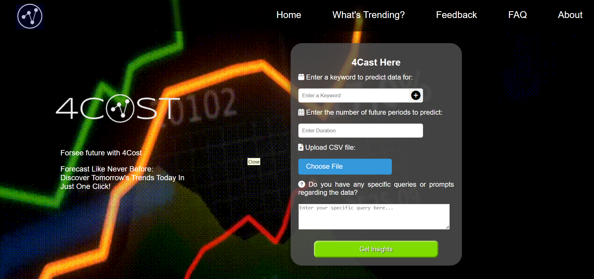
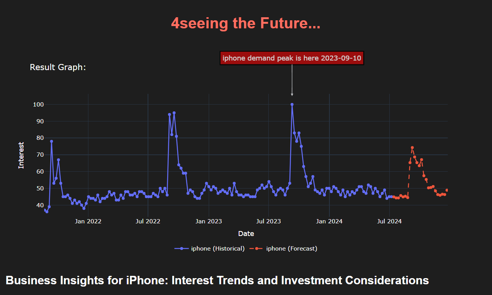

# Product Forecasting and Business Insights

This project uses Google Trends data to forecast product interest and provide business insights. It leverages various technologies such as Django for the web framework, Pytrends for Google Trends data fetching, Statsmodels for forecasting, Plotly for graphing, and Google Generative AI for generating business insights.

## Features

- Fetch historical data from Google Trends.
- Upload and process client-provided CSV files.
- Compare client data with real-time Google Trends data.
- Forecast future interest using Exponential Smoothing.
- Visualize historical and forecasted data using Plotly.
- Generate detailed business insights with Google Generative AI.

## Requirements

- Python 3.x
- Django
- Pytrends
- Pandas
- Statsmodels
- Plotly
- Google Generative AI Python Client
- Markdown

## Installation

1. Clone the repository:
    sh
    git clone [https://github.com/UjaasChokeda/team404-4Cast.git](https://github.com/UjaasChokeda/team404-4Cast.git)
    cd product-forecasting
    

2. Create a virtual environment and activate it:
    sh
    python -m venv venv
    source venv/bin/activate  # On Windows use `venv\Scripts\activate`
    

3. Install the required packages:
    sh
    pip install -r requirements.txt
    

4. Set up your Google Generative AI API key:
    - Create a file named .env in the project root directory.
    - Add your API key in the following format:
        env
        GOOGLE_GENAI_API_KEY=your_api_key_here
        

5. Run the Django development server:
    sh
    python manage.py runserver
    

## Usage

- Access the application at http://127.0.0.1:8000.
- Use the provided web interface to input keywords or upload a CSV file for forecasting.
- The application will fetch historical data, perform forecasting, compare client data with real-time Google Trends data, generate insights, and display the results.

## Project Structure

- views.py: Contains the main logic for handling requests and processing data.
- urls.py: URL routing for the web application.
- templates/: HTML templates for rendering the web pages.
- static/: Static files such as CSS and JavaScript.
- Customer_Data/: Directory to save customer data files.
- keyword_data.json: Storage file for cached Google Trends data.

## Key Functions

- index: Renders the home page.
- about: Renders the about page.
- feedback: Renders the feedback page.
- faq: Renders the FAQ page.
- trending: Renders the trending page.
- save_feedback: Handles saving feedback data.
- save_to_text_file: Saves customer data to a text file.
- load_data_from_file: Loads cached data from the storage file.
- fetch_google_trends_data: Fetches data from Google Trends with retries.
- complex_graph_data_to_text: Converts graph data to text descriptions.
- predict: Handles the main logic for fetching, forecasting, comparing data, and displaying results.

## Screenshots

### Home Page

### Result Page

## Contributing

Contributions are welcome! Please open an issue or submit a pull request for any improvements or bug fixes.

## License

This project is licensed under the MIT License.
